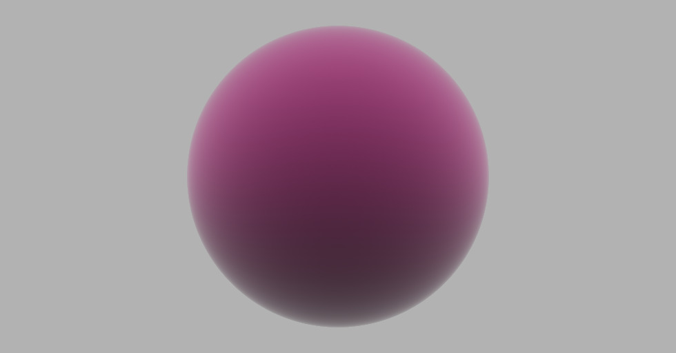

This a simple volume renderer written in python. The code is structured like a C++ project and is not super pythonic. The original code in C++ is from  <a href="https://www.scratchapixel.com/lessons/3d-basic-rendering/volume-rendering-for-developers/intro-volume-rendering.html">Scratchapixel</a>. For pythonic implementation of volume renderer check out my vectorized volume renderer repo where I used numpy to speed the process up. This implementations contains both foward- and backward-ray marching.

